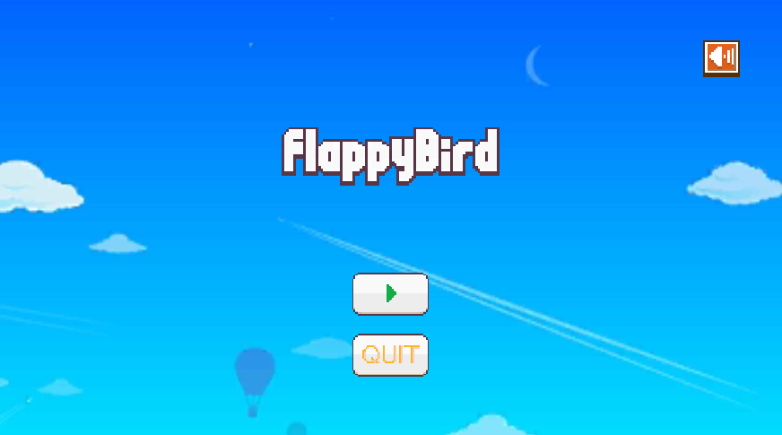
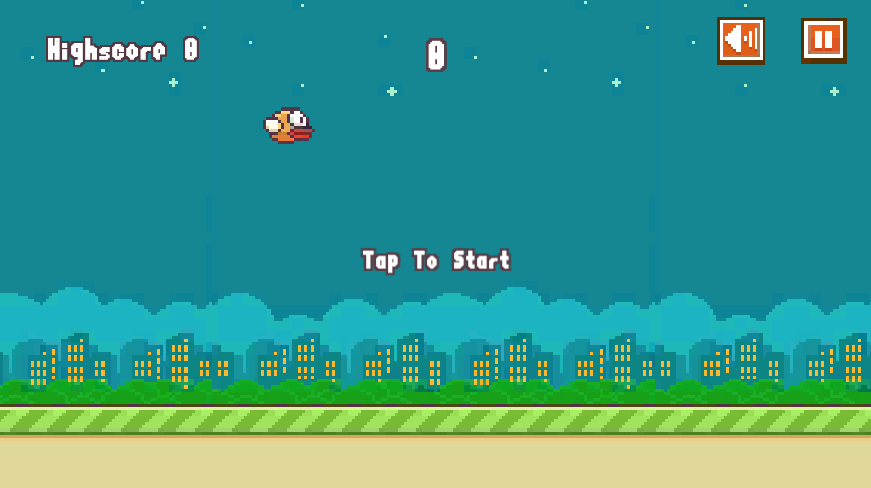
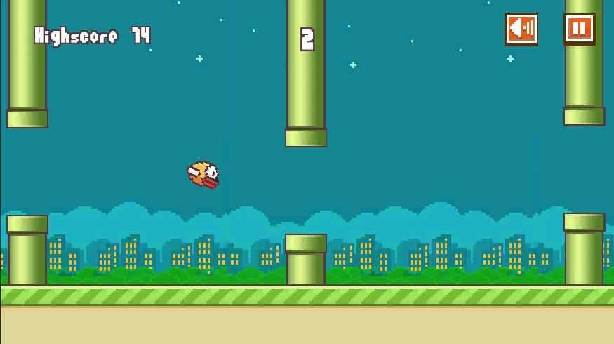
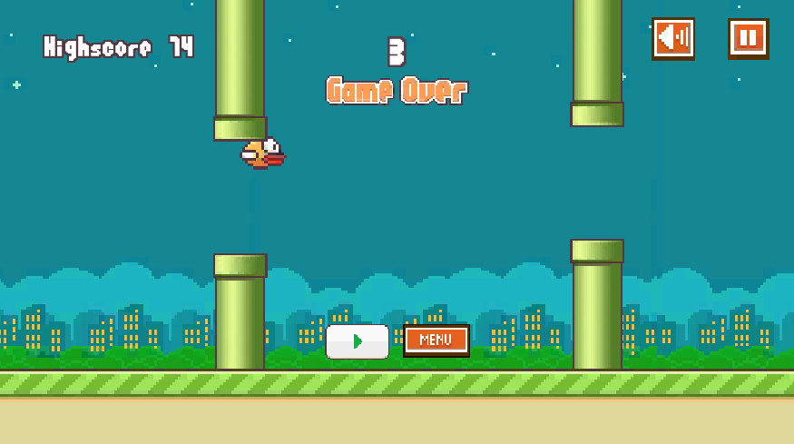
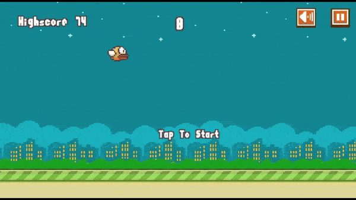

# Flappy Bird Clone

Welcome to the Flappy Bird Clone project! This is a recreation of the popular Flappy Bird game using the Unity game engine. The project demonstrates basic game mechanics, physics, and UI elements commonly found in 2D platformer games.

## Table of Contents
- [Overview](#overview)
- [Features](#features)
- [Installation](#installation)
- [Usage](#usage)
- [Contributing](#contributing)
- [Acknowledgements](#acknowledgements)

## Overview

This project is a faithful reproduction of the classic Flappy Bird game, where players navigate a bird through a series of pipes by tapping the screen or pressing a key. The game includes various elements such as scoring, game-over conditions, and basic animations.

<p>
  
  
  
  
</p>



## Features

- **2D Physics**: Realistic bird movement with gravity.
- **Dynamic Obstacles**: Pipes that move across the screen and reset.
- **Scoring System**: Points are awarded for successfully passing between pipes.
- **Game Over Screen**: Displays the final score and an option to restart the game.
- **Responsive Controls**: Tap or click to flap the bird's wings.

## Installation

To get started with this project, follow these steps:

### Clone the Repository

```bash
git clone https://github.com/yourusername/FlappyBirdClone.git
```
## Open the Project in Unity

1. Ensure you have Unity installed.
2. Open Unity Hub and select **"Add"** to add the project folder.

## Setup and Run

1. Open the project in Unity.
2. Ensure all assets are correctly imported.
3. Click the **"Play"** button in the Unity editor to start the game.

## Usage

Once you have the project set up:

- Tap the screen to control the bird.
- Try to navigate through the pipes to score points.
- The game ends when the bird collides with a pipe or the ground.
- Restart the game by clicking the restart button on the game over screen.

## Contributing

Contributions are welcome! If you'd like to contribute to the project, please follow these guidelines:

1. Fork the repository.
2. Create a new branch for your feature or bugfix.
3. Commit your changes.
4. Push to your forked repository.
5. Open a pull request describing your changes.

Please ensure your code adheres to the project's style and includes appropriate tests where applicable.


## Acknowledgements

- **Original Game**: Flappy Bird by Dong Nguyen.
- **Unity**: For the powerful game development platform.
- **Open Source Assets**: Used for various game elements.

Feel free to reach out with any questions or suggestions. Enjoy the game!
